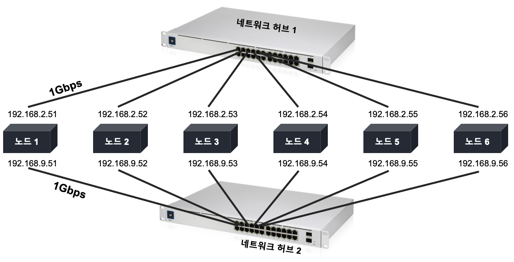

# 레디스 운영 시 고려사항

## 1. 임계점

### 1.1. CPU

레디스는 데이터 저장과 조회에 **단일 스레드**를 사용하기 때문에 **단일 코어의 성능이 높은 장치에서 더 빠른 성능**을 보인다.


_**Redis 6 (2020.04.30)**_

* 명령어를 실행하는 코어 부분은 싱글 스레드를 사용한다.
* I/O Socket read/write는 멀티 스레드로 동작한다.
  * I/O Socket read/write : 명령을 파싱하는 연산과 결과를 반환하는 연산
* 즉, 주요 명령은 단일 스레드로 동작하게 되는데 이러한 이유는 **context switching과 lock으로 발생하는 병목 현상을 방지하기 위함**이다.

\
[Diving Into Redis 6.0 | Redis](https://redis.com/blog/diving-into-redis-6/)


멀티코어 시스템에서 레디스의 성능을 최대로 끌어내기 위해서 **인스턴스를 코어 수 만큼 실행하는 방안**을 생각해볼 수 있다. 이와 같은 상황에서의 **첫 번째 임계점은 CPU 리소스**이다. 만약 각 코어마다 하나의 인스턴스가 점유하게 된다면 **운영체제 운용에 필요한 리소스가 부족하게 되어** 결과적으로 다른 레디스 인스턴스의 응답 속도도 동시에 느려지게 된다.

**두 번째 임계점은 메모리 대역폭**이다. 레디스는 명령어 처리를 위해 메모리에 접근하고, 조회된 데이터는 메모리 대역폭을 사용하여 데이터 버스를 통해서 코어로 전송하게 된다. 즉, 8개의 레디스 인스턴스가 **메모리 대역폭을 나누어 사용하므로 병목 현상이 발생**한다.

### 1.2. 메모리 크기

레디스에 저장될 메모리의 크기는 `redis.conf` 의 **`maxmemory`** 값을 통해 설정할 수 있다. 만약 `maxmemory` 값을 설정하지 않으면, 레디스는 **물리 데이터를 모두 사용하게 된다.**

이때 운영체제는 애플리케이션이 시스템에서 사용 가능한 물리 메모리보다 더 많은 메모리를 사용하려고 할 때 **하드디스크에 가상 메모리 공간을 생성**하여 사용하는데, 이 영역을 **`스왑공간(Swap Space)`** 이라 부른다.

만약 이 스왑공간이 충분하지 않으면 운영체제는 메모리에서 동작 중인 프로세스를 제거하여 사용 가능한 메모리 영역을 확보하게 된다. 이처럼 동작 중인 프로세스를 죽이는 리눅스의 프로그램을 **OOM(Out Of Memory) 킬러** 라고 한다.

그러므로 OOM 킬러를 피하려면 충분한 스왑공간을 확보해야 한다. 하지만 **스왑공간은** 결국 디스크를 사용하는 것이기 때문에 메모리를 사용할 때보다 **성능이 매우 떨어지게 된다.**

즉, 응답시간이 중요한 서비스에서는 **레디스가 사용할 메모리의 크기를 지정하는 것이 유리하다.**

### 1.3. 네트워크

2개의 샤드를 구성한 예시를 살펴보자.

.png>)

위의 논리 구성에서는 아무런 문제점이 보이지 않지만, 논리 구성을 실제 하드웨어와 대응시켜 물리 구성을 살펴보자.

.png>)


_**몇 가지 가정을 사용하여 숫자로 병목 현상을 파악해보자.**_\
\
네트워크 허브의 속도 : 1Gbps\
각 노드의 네트워크 카드의 속도 : 1Gbps\
&#x20;\- 이론상 최대 데이터 전송률은 약 125MB 이며, 실제로는 100MB 내외이다.


각 노드는 초당 2만 번의 읽기 요청을 처리할 수 있으므로 논리 구성에서 이론적으로 처리 가능한 요청은 초당 12만 번(2만 x 6개의 노드)이다. 각 요청이 평균 5KB의 데이터를 요청한다면 120,000 \* 5 / 1,024 = 585MB 의 데이터가 전송된다. 이미 네트워크 허브가 처리할 수 있는 데이터의 크기를 넘어서고 있으므로 **모든 노드가 데이터를 전송하기 위해서 대기**하게 되고 6개 노드의 전체 성능을 사용하지 못하게 된다.

충분한 네트워크 대역폭을 확보하기 위해서 네트워크 허브를 10Gbps 장비로 교체하면 문제가 해결될 것인가?

하지만 이또한 **복제를 위한 마스터와 슬레이브 간 데이터 전송과 네트워크 단절에 의한 데이터 동기화** 과정에서 문제가 발생한다.

이와 같은 상황에서 네트워크 임계점에 다다르는 것을 방지하기 위해서 다음과 같이 네트워크를 구성을 한다.

* 하나의 노드에 두 개의 네트워크 카드를 설치하고 각각의 네트워크 카드를 다른 네트워크 허브에 연결했다.
  * 네트워크 허브1에 연결된 192.168.2.\* 대역의 IP는 레디스의 **읽기와 쓰기 연산을 위해서 사용**
  * 네트워크 허브2에 연결된 192.168.9.\* 대역의 IP는 레디스의 **관리와 복제를 위해서 사용**

이와 같이 네트워크를 구성하면 서비스를 위한 네트워크 대역폭을 분리하여 네트워크 병목현상을 피할 수 있다.

## 2. 메모리 설정

레디스를 운영하다보면 남은 메모리가 많은데도 불구하고 **fork 함수의 수행이 실패**하는 경우가 있다.


_**레디스에서 `fork` 함수를 왜 호출할까?**_\
\
레디스는 데이터의 영속성을 위해서 Snapshot 방식과 AOF 방식을 지원한다.\

* Snapshot : 현재 메모리에 있는 내용들을 디스크에 옮기는 방식
* AOF(Append Only File) : 레디스의 쓰기 연산을 log 파일에 기록한다.

\
이 두 방식은 메모리의 데이터를 디스크에 옮기는 연산을 할 때 fork 를 호출하여 처리하게 된다.


fork 함수는 부모 프로세스와 동일한 크기의 메모리를 사용하는 프로세스를 생성한다. 이때 부모 프로세스가 사용하는 만큼의 메모리가 남아있지 않으면 fork 함수가 실패하게 된다. 이런 현상을 방지하기 위해서 **리눅스의 `/etc/sysctl.conf` 파일에 `vm.overcommit_memory=1` 옵션을 추가하면 된다.**


`vm.overcommit_memory` 설정 값\

* `0` : 기본 설정값, malloc 함수의 요청이 들어오면 요청된 크기만큼의 물리적 메모리가 존재할 때에만 메모리를 할당한다.
* `1` : 요청으로 입력된 크기의 스왑영역이 존재할 때에만 성공한다.
* `2` : 사용 중인 메모리 크기가 ‘스왑공간 크기 + vm.overcommit\_ratio \* 물리 메모리 크기’ 이내일 때 메모리를 할당한다.



이 상태에서 쓰기 연산이 들어오게 되면 부모 프로세스가 운영체제에게 추가적인 메모리 할당을 요청하게 되고, 운영체제는 요청된 메모리를 스왑영역을 할당하게 된다. 즉, **디스크에 데이터를 기록**하게 되므로 추가적인 응답시간이 필요하게 되어 **응답시간이 길어진다.**

그렇다면 평균적인 응답속도를 유지하기 위해서 가장 적절한 메모리의 크기는 어떻게 산정해야 할까?

만약 전체 연산 횟수가 100이라면 이 중에서 쓰기 연산의 비율이 50%를 넘는다면 물리 메모리의 60%를 지정하는 것이 적당하다. 이 값을 기준으로 쓰기 비율이 줄어들수록 지정 가능한 메모리의 비율을 늘릴 수 있다.

## 3. 기타 고려사항

### 3.1. 스냅샷

레디스의 스냅샷 이벤트가 발생하면 매우 짧은 시간에 매우 많은 디스크 입출력이 발생하는데, **외부 저장장치로 스냅샷 파일을 기록하게 되면 많은 시간이 소요**되어 전체적인 성능이 떨어지게 된다.

그러므로 만약 외부에 스냅샷 파일을 저장하고 싶다면 로컬 파일 시스템에 먼저 **스냅샷을 생성하고 복사하여 저장**하는 방법을 권장한다.

### 3.2. fork 함수

레디스는 데이터의 영속화를 지원하기 위해 AOF(Append Only File)와 스냅샷을 지원한다. 이 AOF와 스냅샷은 **fork 함수와 COW(Copy On Write)를 사용하여 백그라운드 저장 프로세스를 생성**한다.


_**COW(Copy On Write)란?**_\
\
Linux(Unix)에서는 자식 프로세스(child process)를 생성(fork)하면 같은 메모리 공간을 공유하게 된다. 그런데 부모 프로세스가 데이터를 새로 넣거나, 수정하거나, 지우게 되면 같은 메모리 공간을 공유할 수 없게 된다. 이때 부모 프로세스는 해당 페이지를 복사한 다음 수정한다. 이것을 COW(Copy On Write)라고 한다.


레디스는 단일 스레드로 동작하기 때문에 fork 함수가 완료되기 전에는 다른 명령을 수행하지 못한다. 그러므로 **응답시간 확보가 필수라면 샤딩을 고려해야 한다.**

### **3.3. 복제 구성**

레디스의 복제를 구성할 때 하나의 마스터에 너무 많은 슬레이브를 구성하지 않도록 한다.


_**하나의 마스터에 많은 슬레이브를 할당했을 경우 발생하는 문제점**_\

1. 데이터 복제를 위한 연산이 데이터 서비스를 위한 연산보다 더 많이 소요되어 응답속도가 느려진다.
2. 많은 슬레이브 노드들이 마스터 노드에 데이터 복제 요청을 하기 때문에, 마스터 노드는 해당 요청에 응답하기 위해 리소스 대부분을 사용하게 되어 쓰기 요청이 지연된다.


## 4. 마치며

레디스 클러스터를 구성할 때는 반드시 메모리와 네트워크 등의 임계점에 대한 측정이 선행되어야 한다.

## Reference




